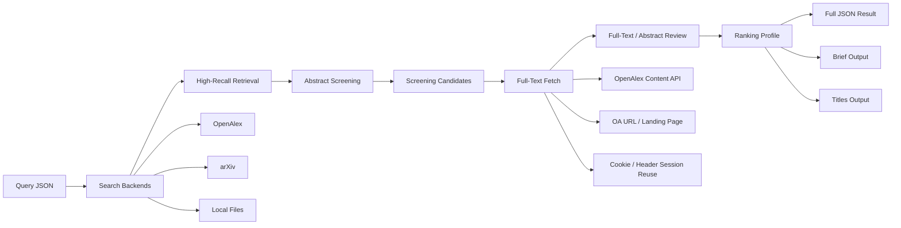

# Paper-Reach

Give your AI agent a rigorous literature review workflow.

`Paper-Reach` is an open-source skill + CLI scaffold for literature search, abstract screening, full-text review, evidence extraction, and conservative ranking.

It is built for coding agents such as Codex, Claude Code, OpenClaw, Cursor, and similar tools, but it also works as a standalone Python CLI.

The point is not “search more sources.” The point is “screen papers better with evidence.”

## What's New

- OpenAlex content API is now used first when an API key is configured
- `run --bundle-dir` writes a full run bundle with stage-by-stage outputs
- `summarize` exports compact `titles` and `brief` views for human review
- profile-based ranking supports task-specific hard gates and weighted scoring
- multi-host skill packaging is included for Codex, Claude-style, and Gemini-style hosts

## Why This Exists

Most paper-search tooling stops too early:

- title match is treated like real relevance
- abstract-only evidence is overclaimed
- failed PDF access breaks the workflow
- outputs are too verbose for humans and too messy for agents

Paper-Reach separates the workflow into explicit stages:

1. retrieve candidate papers
2. screen conservatively at abstract level
3. fetch full text when available
4. review with stronger evidence
5. rank and export both machine-readable and human-readable results

## Architecture



## Core Capabilities

- High-recall literature retrieval with multi-query expansion
- Conservative abstract screening with explainable reasons
- Optional full-text review with graceful fallback when PDFs are unavailable
- OpenAlex-first PDF fetching when API access is configured
- Offline support for local PDFs, TXT, JSON metadata, DOI lists, and title lists
- JSON-first outputs for downstream agents and reproducible workflows
- Compact exports for humans: `titles` and `brief`
- Multi-host skill packaging for agent ecosystems

## A Concrete Example

Here is a query for a practical review task:

`Find papers that use static or gridded population data in China for disaster exposure or infectious-disease exposure assessment, so they can be used as baselines when comparing dynamic population methods.`

Example query:

```json
{
  "topic": "China static population exposure assessment for disasters and infectious disease",
  "keywords": [
    "China",
    "static population",
    "gridded population",
    "census population",
    "population exposure",
    "population at risk",
    "disaster exposure",
    "hazard exposure",
    "infectious disease exposure",
    "WorldPop",
    "LandScan",
    "GPW"
  ],
  "inclusion_criteria": [
    "study area is in China",
    "uses static population data or gridded population as exposure input",
    "focuses on disaster exposure or infectious-disease exposure",
    "estimates exposed population or population at risk"
  ],
  "exclusion_criteria": [
    "study area outside China only",
    "not an exposure study",
    "generic epidemiology without exposure modeling",
    "dynamic mobility only without static population baseline"
  ],
  "year_range": [2005, 2026],
  "max_results": 200,
  "need_gap_analysis": true,
  "mode": "auto",
  "require_fulltext_for_selection": false,
  "profile": "static_population_exposure_baseline"
}
```

Run it:

```bash
paper-reach run \
  --input query.json \
  --output result.json \
  --bundle-dir ./runs/china_static_population \
  --high-recall \
  --retrieval-limit 200 \
  --workers 8
```

This will produce:

```text
runs/china_static_population/
├─ 00_query.json
├─ 10_screen.json
├─ 20_fetched_papers.json
├─ 30_result_full.json
├─ 40_result_brief.json
├─ 50_result_titles.json
├─ manifest.json
└─ downloads/
```

## What Makes This Different

Paper-Reach is not trying to be a giant autonomous research platform.

It is a practical starter repo for rigorous literature screening:

- title-only relevance is weak evidence
- abstract-supported relevance is useful but still provisional
- full-text-supported relevance is the strongest basis for selection

This distinction is built into the workflow and the output schema.

## Installation

### 1. Install as a normal CLI

```bash
python -m venv .venv
source .venv/bin/activate
pip install -e .[dev]
paper-reach doctor
```

### 2. Install as a skill bundle for agent hosts

```bash
pip install -e .[dev]
bash scripts/sync.sh
bash scripts/check-install.sh
```

Common install targets:

- `~/.codex/skills/paper-reach`
- `~/.claude/skills/paper-reach`
- `~/.agents/skills/paper-reach`

## Quick Start

```bash
paper-reach doctor
paper-reach example-query > query.json

paper-reach screen \
  --input query.json \
  --output screen.json \
  --high-recall \
  --retrieval-limit 200

paper-reach run \
  --input query.json \
  --output result.json \
  --bundle-dir ./runs/demo \
  --high-recall \
  --retrieval-limit 200 \
  --workers 8

paper-reach summarize \
  --input result.json \
  --output brief.json \
  --format brief \
  --top-k 20
```

## OpenAlex-First Full-Text Fetching

If `OPENALEX_API_KEY` or `OPENALEX_CONTENT_API_KEY` is configured, Paper-Reach will try the OpenAlex content API first:

```bash
export OPENALEX_API_KEY=your_key
```

Download priority:

1. OpenAlex content API
2. Open-access PDF URL
3. landing page extraction
4. user-authorized session reuse via cookies / headers
5. graceful fallback to abstract-only review

## Output Philosophy

Paper-Reach always keeps two output styles:

- full JSON for agents and downstream tooling
- compact JSON for humans

The compact modes are:

- `titles`
  - just title + URL
- `brief`
  - title, URL, year, decision, reasons, venue, PDF path, and other short review fields

This means you do not have to choose between reproducibility and readability.

## Multi-Host Skill Support

Paper-Reach follows the same pattern used by mature cross-host skill repos:

- one shared execution engine
  - `paper-reach` CLI + `paper_reach/` package
- one host-agnostic skill entrypoint
  - `SKILL.md`
- thin host-specific manifests
  - `agents/openai.yaml`
  - `.claude-plugin/plugin.json`
  - `gemini-extension.json`

This keeps the workflow logic in one place while making the skill discoverable in different ecosystems.

## Repository Structure

```text
paper-reach/
├─ README.md
├─ AGENTS.md
├─ SKILL.md
├─ docs/
├─ examples/
├─ skills/
├─ agents/
├─ .claude-plugin/
├─ paper_reach/
├─ scripts/
└─ tests/
```

Key areas:

- `paper_reach/`
  - CLI, workflow, models, ranking, fetchers, parsers
- `skills/`
  - paper-search, paper-reader, paper-ranker
- `examples/`
  - example queries, auth examples, agent recipes
- `docs/`
  - install, usage, architecture, roadmap, publishing

## Documentation

- [docs/install.md](docs/install.md)
- [docs/usage.md](docs/usage.md)
- [docs/architecture.md](docs/architecture.md)
- [docs/agent-integration.md](docs/agent-integration.md)
- [docs/browser-cookies.md](docs/browser-cookies.md)
- [docs/publishing.md](docs/publishing.md)
- [docs/roadmap.md](docs/roadmap.md)

## Contributing

Contributions are most useful when they improve:

- screening quality
- evidence extraction
- backend extensibility
- offline usability
- agent integration

The project should stay modular, conservative, and easy to extend.
